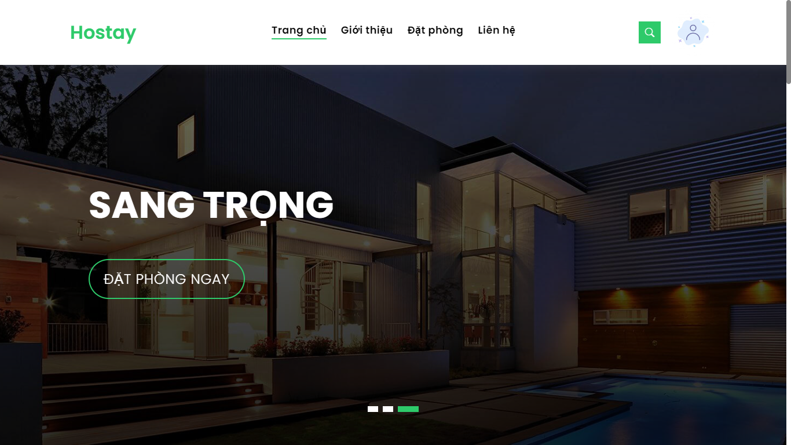
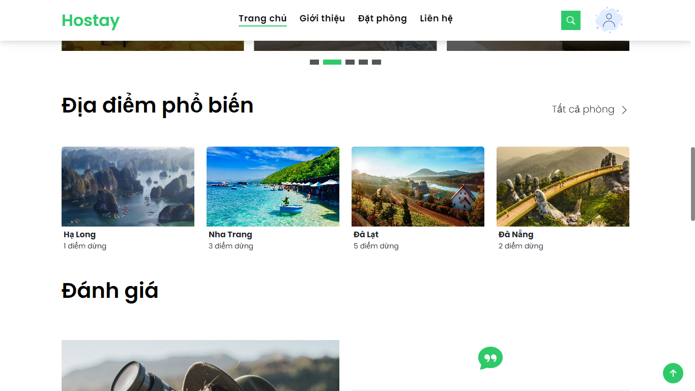
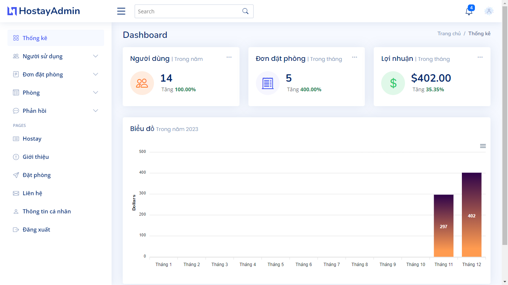

### Ghi chú:
- Đặt tên folder là ```hostay```
- Chỉnh sửa thông tin kết nối MySql ở file ```php.config.ini```
- Nên sử dụng **Xampp** để chạy localhost.
---
### Demo

<div align="center">
    
</div>

---

<div align="center">
    
</div>

---

<div align="center">
    
</div>
